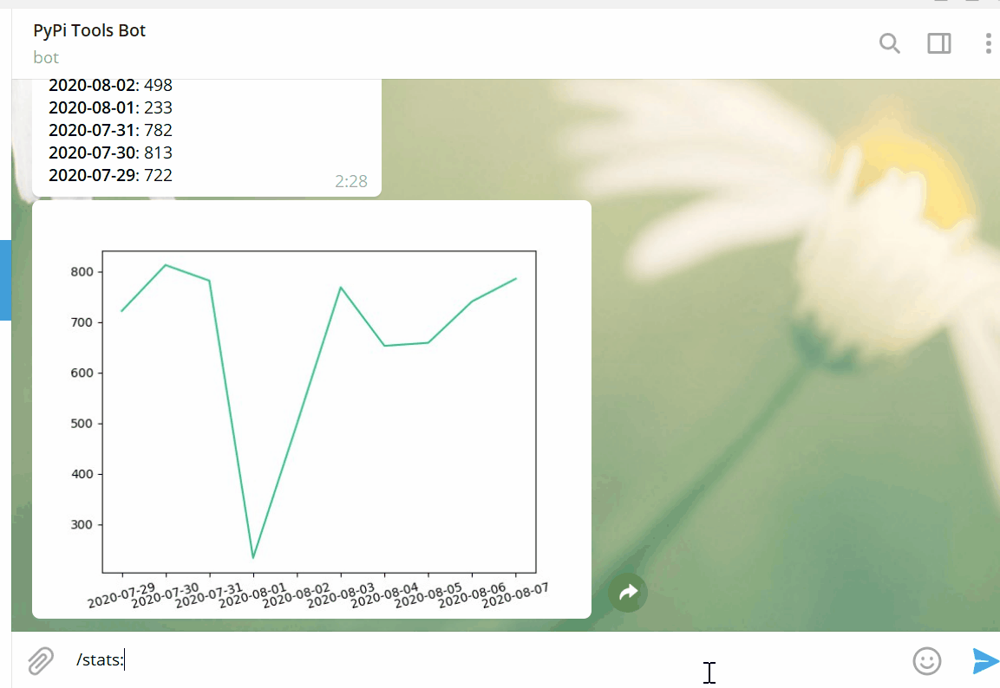

## Python PyPi Bot for Telegram 

Bot provide set of commands to work with PyPi 

You can use Bot in Telegram - https://t.me/pypi_tools_bot

Or set up it & run on your own server & telegram bot.

Available commands:

- **/track package_name**

    Description: Command to add package to your track for getting updates about new releases on PyPi. 
                 You will get notification when new release will be able on PyPi. \n" \
    Example: */track flask*
    
    Sub-command **:stop** 
    
        Description: use for removing package from track and stop getting updates about releases \n" \
        Example: */track:stop*
    
    Sub-command **:nodev** 
    
        Description: to get updates without dev releases (versions alpha, beta and etc will be excluded from notifications)
        Example: */track:nodev flask*

- **/stats package_name**
    
    Description: return download statistic for last 5 days
    
    You can setup for how many days you want to have statistic with defining days numbers after command.
    Example: */stats:10 gino* Bot will send to you download statistic for 10 days.

- **/plot package_name**
    
    Description: return plot with download statistic for last 5 days
    
    You can setup for how many days you want to have statistic with defining days numbers after command.
    Example: */plot:10 gino* Bot will send to you download statistic for 10 days.

- **/search package_name**
    
    Description: return info about package and links to Package's homepage and PyPi page
    Example: */search package_name*
    
    Sub-command **:detailed**
        
        Description: return explicit info about package
        Example: */search:detailed package_name*
    

- **/help**

    Description: To get help
    
- **/releases package_name**

    Description: Use this command to get a list with 7 last package releases with dates.
    Example: */releases aiohttp*
    
    Sub-command **/releases:full** 
        Description: to get full list of package releases with dates
        Example: */releases:full aiohttp*

- **/random** 

    Commands returns random package from PyPi
    Example: */random*

